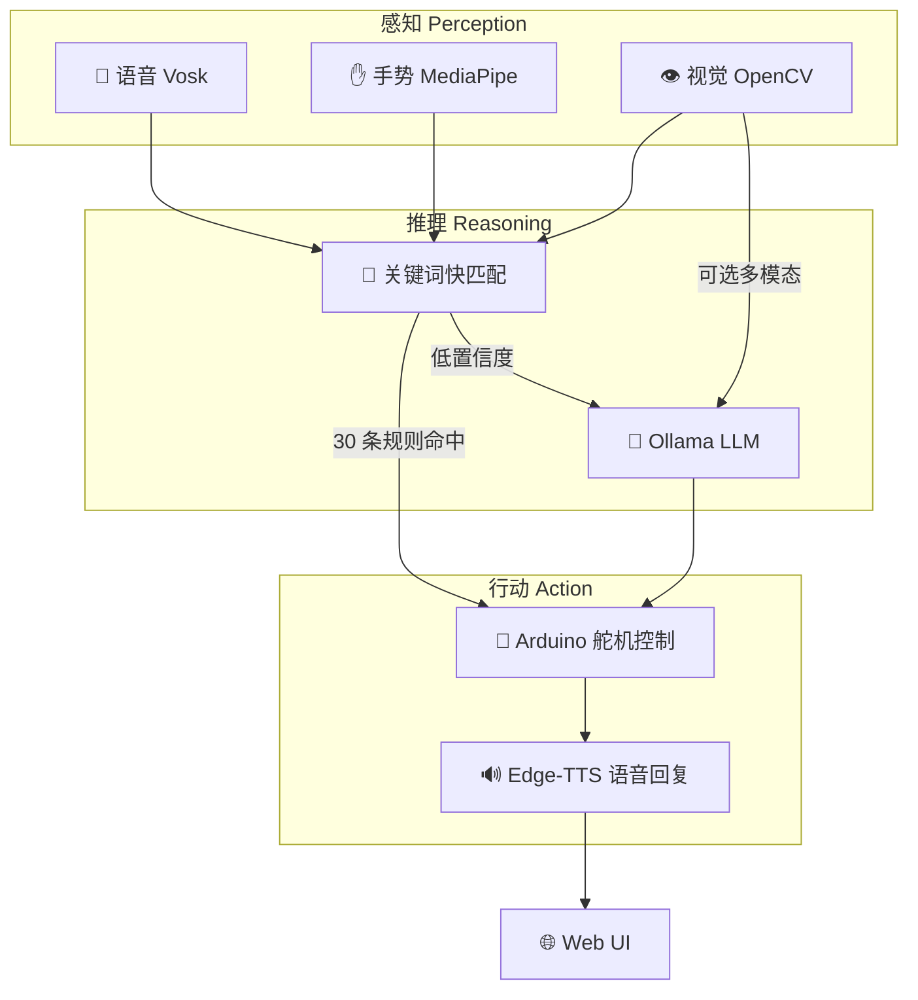

# 🦾 MeArm 具身智能演示台

[](https://www.python.org/)
[](LICENSE)

> **感知 → 推理 → 行动**：一个基于低成本开源硬件和本地 LLM 的具身智能动手 Demo。
> 语音控、手势识、画面看、脑子想、动手干——全部离线运行在你自己电脑上。

<p align="center">
  <i>🎤 "抓红色那个" / "拿杯子" → 👁️ YOLO+HSV找到物体 → 🧠 理解意图 → 🦾 抓取放置 → 🔊 "杯子放好了~"</i>
</p>

---

## 💡 什么是具身智能 Demo？

**具身智能 (Embodied Intelligence)** 的核心思想是：智能不能只存在于抽象符号中，它需要一个身体来感知世界、理解上下文、并付诸行动。

这个项目用 **不到 300 元** 的硬件成本，搭建了一个完整的具身智能最小闭环：

| 环节 | 实现方式 | 运行位置 |
|------|---------|---------|
| 👁️ **感知** | 摄像头 + 麦克风 → 看到物体、听到指令、识别手势 | 本地 |
| 🧠 **推理** | Ollama LLM → 理解自然语言意图、决策下一步动作 | 本地 |
| 🦾 **行动** | Arduino + 4 舵机 → 抓取、指向、挥手等物理动作 | 本地 |

它不是学术研究级的系统，而是一个**可运行、可修改、可理解的动手 Demo**——适合用来理解「AI + 机器人」的基本工作方式。

---

## ✨ 功能特性

| 功能 | 说明 |
|------|------|
| 🧠 **LLM 意图解析** | Ollama 本地 / 云端 API 自适应，自然语言→机械臂动作 |
| 🎤 **离线语音识别** | Vosk 中英文双模型并行，无需联网 |
| ✋ **手势控制** | MediaPipe 手部关键点检测，6 种手势识别 |
| 👁️ **视觉感知** | YOLOv8s 深度学习 (80类) + HSV 颜色 + Ollama Vision API 回退 |
| 🌐 **Web 仪表盘** | Flask + SocketIO 实时控制的深色主题 Web UI |
| 🔊 **语音播报** | Edge-TTS 神经语音合成，自然口语回复 |
| 📝 **关键词快匹配** | 30 条规则覆盖 13 类指令，无 LLM 也能用 |
| 🧠 **自学习** | TF-IDF 交互记忆 + 用户画像 + 动态提示词增强 |
| 🔐 **完全离线** | 所有数据本地处理，不上传任何信息 |
| 🛡️ **安全模式** | 逐关节步进控制，防 USB 过载，手势冷却机制 |

---

## 🏗️ 硬件搭建

> **图纸与装配参考**：[Instructables: MeArm Robot Arm - Your Robot V1.0](https://www.instructables.com/MeArm-Robot-Arm-Your-Robot-V10/) — 包含完整的激光切割图纸 (DXF)、装配步骤和舵机校准说明。

### 物料清单

MeArm V1.0 为开源设计，主体由一片 A4 大小的 3mm 亚克力板激光切割而成，配合以下标准件组装：

| 类别 | 物料 | 数量 | 备注 |
|------|------|------|------|
| 舵机 | SG90 9g 微型舵机 | 4 | 底座×1、左臂×1、右臂×1、夹爪×1 |
| 主控 | Arduino Uno / Nano | 1 | 或兼容板 |
| 紧固件 | M3×6mm 螺丝 | 9 | 全机共 35 颗螺丝 + 10 颗螺母 |
| | M3×8mm 螺丝 | 12 | |
| | M3×10mm 螺丝 | 3 | |
| | M3×12mm 螺丝 | 7 | |
| | M3×20mm 螺丝 | 4 | |
| | M3 螺母 | 10 | |
| 结构 | 3mm 亚克力板 (~A4) | 1 | [DXF 图纸](https://github.com/phenoptix/meArm-1) |
| 电源 | 5-6V DC / 2A+ | 1 | 舵机供电，勿超 6V |
| 摄像头 | USB 摄像头 | 1 | 手机 IP 摄像头也可 |
| 可选 | Arduino 传感器扩展板 | 1 | 简化接线 |
| 可选 | 舵机延长线 | 若干 | |

### 舵机接线

| 舵机 | 功能 | Arduino 引脚 |
|------|------|-------------|
| 中间 (middle) | 底座旋转 | D11 |
| 左侧 (left) | 肩关节 | D10 |
| 右侧 (right) | 肘关节 | D9 |
| 夹爪 (claw) | 开合 | D6 |

> ⚠️ **组装前务必先校准舵机**：上电后用测试代码将每个舵机调到中位，再按正确角度安装臂杆，避免卡死或扫齿。

---

## 🚀 快速开始

### 1. 克隆仓库

```bash
git clone https://github.com/<your-username>/mearm-workbench.git
cd mearm-workbench
```

### 2. 安装 Python 依赖

```bash
pip install -r requirements.txt
```

### 3. 下载模型文件

参考 **[DEPENDENCIES.md](DEPENDENCIES.md)** 下载并放置 Vosk 语音模型、MediaPipe 手势模型和 Ollama LLM。

快速命令：
```bash
# 创建 models 目录
mkdir -p models

# 下载 Vosk 中文模型
wget https://alphacephei.com/vosk/models/vosk-model-small-cn-0.22.zip
unzip vosk-model-small-cn-0.22.zip -d models/

# 下载 Vosk 英文模型
wget https://alphacephei.com/vosk/models/vosk-model-small-en-us-0.15.zip
unzip vosk-model-small-en-us-0.15.zip -d models/

# 下载 MediaPipe 手势模型
wget -O models/hand_landmarker.task \
  https://storage.googleapis.com/mediapipe-models/hand_landmarker/hand_landmarker/float16/latest/hand_landmarker.task

# 安装并拉取 Ollama 模型
ollama pull qwen2.5:7b
```

### 4. 烧录 Arduino 固件

将 `主程序.txt` 中的代码上传到 Arduino Uno。

### 5. 配置环境变量 (可选)

```bash
cp .env.example .env
# 编辑 .env 按需修改
```

### 6. 启动

```bash
# 模拟模式 (无硬件)
python workbench_server.py

# 连接 Arduino
python workbench_server.py --port COM3

# 完整模式
python -m mearm_controller.server --port COM3 --cam 1
```

浏览器自动打开 `http://localhost:5000`。

---

## ⌨️ CLI 参数

```
--port PORT          Arduino 串口 (如 COM3)
--cam INDEX          摄像头索引 (默认 0, 可用 'auto')
--ip-cam URL         手机 IP 摄像头 URL
--ollama-url URL     Ollama API 地址 (默认 http://localhost:11434/v1)
--api-key KEY        云端 LLM API Key (OpenAI 兼容, 如 DeepSeek)
--api-base-url URL   云端 LLM API 地址 (默认 https://api.deepseek.com)
--vision-api-key KEY 云端多模态视觉 API Key (如 Moonshot/Kimi)
--no-llm             仅关键词模式, 跳过 LLM
--no-voice           禁用语音识别
--no-browser         不自动打开浏览器
--unsafe             关闭安全模式
```

---

## 🗂️ 项目结构

```
mearm-workbench/
├── mearm_controller/        # 核心控制模块
│   ├── server.py            # 主入口 & 后台线程
│   ├── config.py            # 全局配置
│   ├── llm_parser.py        # LLM 意图解析 + 关键词匹配
│   ├── ik_llm.py            # LLM 增强逆运动学
│   ├── arm_ik.py            # 解析逆运动学求解器
│   ├── arm_serial.py        # Arduino 串口桥接
│   ├── vision.py            # 摄像头 & HSV 颜色检测
│   ├── gesture_recognizer.py # MediaPipe 手势识别
│   ├── voice_listener.py    # Vosk 语音识别
│   ├── speaker.py           # Edge-TTS 语音播报
│   ├── routes.py            # Flask 路由 & SocketIO
│   └── shared_state.py      # 线程安全共享状态
├── mearm_learner/           # 自学习模块
│   ├── memory.py            # 交互记忆存储/检索
│   ├── learner.py           # 用户行为模式学习
│   └── adapter.py           # LLM 提示词动态增强
├── templates/
│   └── workbench.html       # Web 仪表盘
├── models/                  # 模型文件 (自行下载)
├── memory/                  # 交互记忆 (运行时创建)
├── 主程序.txt               # Arduino 固件
├── DEPENDENCIES.md          # 模型下载清单
├── requirements.txt         # Python 依赖
└── .env.example             # 环境变量模板
```

---

## 🎮 使用指南

### 语音控制

| 指令 | 效果 |
|------|------|
| "你好" | 机械臂打招呼~ |
| "抓红色" | 抓取红色物体 |
| "再见" | 挥手告别 |
| "左转 / 右转" | 底座旋转 |
| "抬高 / 放低" | 手臂升降 |
| "前伸 / 后缩" | 肘部伸缩 |
| "张开 / 闭合" | 夹爪控制 |
| "回家 / 回零" | 回到初始位置 |
| "停止" | 停止动作 |

### 手势控制

| 手势 | 触发动作 |
|------|----------|
| 👋 五指张开 | 问候 |
| ✊ 握拳 | 抓取 (配合语音指定颜色) |
| ☝️ 食指指向 | 指向方向 |
| 👍 竖大拇指 | 点赞回应 |
| ✌️ 剪刀手 | 庆祝挥手 |
| 👋 挥手 | 再见 |

---

## ⚙️ 配置

通过 `.env` 文件或环境变量配置：

| 变量 | 默认值 | 说明 |
|------|--------|------|
| `OLLAMA_BASE_URL` | `http://localhost:11434/v1` | Ollama API 地址 |
| `OLLAMA_MODEL` | `qwen2.5:7b` | 本地文本 LLM 模型 |
| `OLLAMA_VISION_MODEL` | (空) | 本地视觉模型 (如 `llava`) |
| `LLM_API_KEY` | (空) | 云端 API Key (设置后自动切换为云端) |
| `LLM_API_BASE_URL` | `https://api.deepseek.com` | 云端 API 地址 |
| `LLM_API_MODEL` | `deepseek-chat` | 云端 LLM 模型 |
| `VISION_API_KEY` | (空) | 云端多模态视觉 API Key |
| `VISION_API_BASE_URL` | `https://api.moonshot.cn/v1` | 云端视觉 API 地址 |
| `VISION_API_MODEL` | `kimi-k2.6` | 云端视觉模型 |
| `VOSK_MODEL_CN` | `models/vosk-model-small-cn` | 中文语音模型路径 |
| `VOSK_MODEL_EN` | `models/vosk-model-small-en-us-0.15` | 英文语音模型路径 |
| `FLASK_SECRET_KEY` | 自动生成 | Flask 会话密钥 |

> 💡 **LLM 提供者选择**: 不设 `LLM_API_KEY` 时默认使用本地 Ollama；设置后自动切换为云端 API。视觉模型同理: 不设 `VISION_API_KEY` 时尝试 `OLLAMA_VISION_MODEL`。

---

## 🔧 架构：感知 → 推理 → 行动

这是一个经典的**具身智能 (Embodied Intelligence)** 最小闭环：系统通过传感器感知物理世界，用 LLM 进行语义理解与决策，再通过执行器作用于物理世界。



**流程说明：**

1. **感知层** — Vosk 离线语音识别（中/英双模型）、MediaPipe 手势关键点检测、OpenCV HSV 颜色定位，三者并行感知用户意图和桌面环境
2. **推理层** — 30 条结构化关键词规则提供零延迟快匹配；未命中时由 LLM 做语义理解（默认本地 Ollama qwen2.5:7b，可选配云端 DeepSeek 等 API）。可选配视觉模型（本地 llava 或云端 Kimi/GPT-4V）实现多模态画面推理
3. **行动层** — 解析后的意图经逆运动学解算为舵机角度，通过串口发送给 Arduino 执行；同时 Edge-TTS 合成自然语音回复

> 默认配置下**无需联网**：所有计算（语音识别、手势检测、LLM 推理、语音合成）都在本地完成。也可通过 `.env` 配置云端 API 以获得更强的推理能力。

---

## 📄 许可证

MIT License

---

## 🙏 致谢

- [Vosk](https://alphacephei.com/vosk/) — 离线语音识别
- [MediaPipe](https://developers.google.com/mediapipe) — 手势关键点检测
- [Ollama](https://ollama.com) — 本地 LLM
- [Edge-TTS](https://github.com/rany2/edge-tts) — 语音合成
- [MeArm](https://mearm.com/) — 开源机械臂设计
